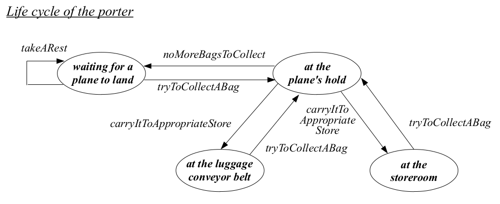
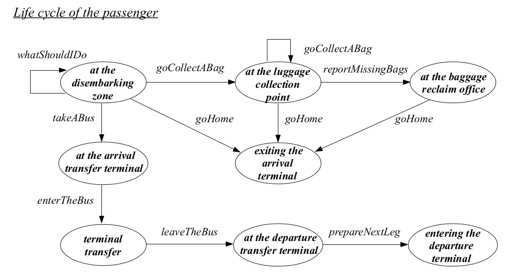
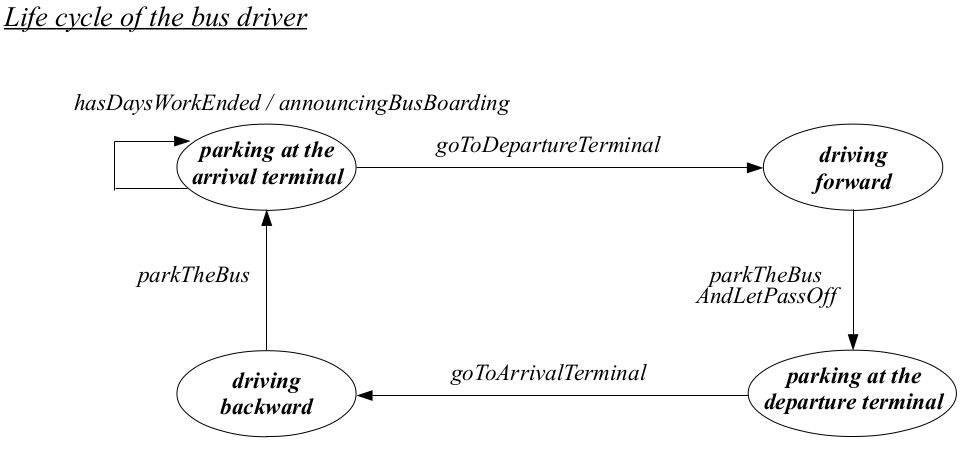

# Airport Rhapsody

Two differents approaches to implement of the airport-rhapsody in Java:

1. Synchronized
2. Message passing

## Requirements

- Java 8
- Maven

# The problem

The described activities take place at an airport, somewhere in Portugal, and aim to portray what
happens when passengers arrive from a flight. There are eight main locations: the arrival lounge, the
baggage collection point, the temporary storage area (for holding the luggage of passengers in transit), the
baggage reclaim office, the terminal transfer quays, the arrival terminal exit and the departure terminal
entrance.
There are three types of entities: the passengers, who terminate their voyage at the airport or are in
transit, the porter, who unloads the the bags from a plane, when it lands, and carries them to the baggage
collection point or to the temporary storage area, and the bus driver, who moves the passengers in transit
between the arrival and the departure terminals.
K plane landings are assumed, each involving the arrival of N passengers. Each passenger carries 0 to
M pieces of luggage in the plane hold. The bus, which moves the passengers between terminals, has a
capacity of T seating places.
Activities are organized, for each plane landing, in the following way
- the passengers walk from the arrival lounge to the baggage collection point, if their journey ends at
this airport and have bags to collect; those without bags go directly to the arrival terminal exit and
leave the airport; the remaining passengers, who are in transit, walk to the terminal transfer quay;
- after all the passengers have left the plane, the porter picks up the pieces of luggage, one by one,
from the plane hold and carries them either to the baggage collection point, or to the temporary
storage area, as they belong to local or in transit passengers, respectively;
- in the baggage collection point, the passengers wait for the arrival of their bags; upon taking
possession of them, they walk to the arrival terminal exit and leave the airport; those with missed
bags go first to the baggage reclaim office to post their complaint, before walking to the arrival
terminal exit and leave the airport;
- on the terminal transfer quay, the passengers wait for the bus arrival, which will take them to the
departure terminal for the next leg of the journey;
- the bus leaves the terminal transfer quay according to a predefined schedule, executing a circular
path which has as another stop the terminal transfer quay of the departure terminal; however, if it
happens that all seats are occupied prior to the predefined time to leave, the driver may depart
sooner.
In the end of the day, a full report of the activities is issued.

## Life cycle of entities






## Run the simulation

On each directory you can the obtain specific information about two approaches.

## Compile javadoc

Run the following command:

```bash
mvn javadoc:javadoc
firefox target/site/apidocs/index.html
```


## Authors

* **Catarina Silva** - [catarinaacsilva](https://github.com/catarinaacsilva)

## License

This project is licensed under the MIT License - see the [LICENSE](LICENSE) file for details
